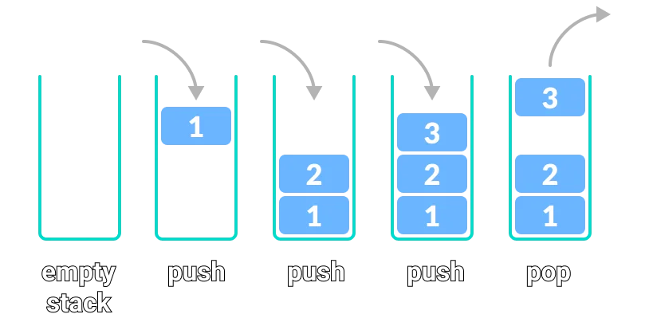

# Matching Brackets

## Tasks

In this exercise you are tasked with creating a program that can evaluate whether there is a balance of brackets
contained in a string. 

An example of this is `[{}]` where there are equally many opening brackets as there are closing.
`[{()]` is an example of no balance between the brackets, as there is a missing closing curly bracket.

### Task 1

Implement the `CheckBrackets` method in `MatchingBrackets`.
The method must be able to check if a string contains a balanced amount of open/closing brackets.
Example:
> `–{ [b ⋅ b – (4 ⋅ a ⋅ c ) ] / (2 ⋅ a }`
> 
> This string should give a `false` value.

A `Stack<char>` can be used to check for balanced brackets:

- When you see an opening parenthesis, push it on the stack.
- When you see a closing parenthesis, pop the stack.
    - If the opening and closing parentheses don’t match - the parentheses are unbalanced.
    - If at the end the stack is empty - the parentheses are balanced.

`Hint: Consider making it easy to change supported brackets types.`

You can use `BracketsDriver` to test your implementation.
### Task 2

> **Goal**
> Use a List structure rather than a Stack.

- Use a List<Character> instead of a Stack - remember that values should be inserted and retrieved in a **LIFO** (Last In, First Out) manner. As you can imagine this will require some logic which is otherwise built into a Stack.
  - You are free to create a new class for this purpose, if you don't want to overwrite the existing one. 
  In this class you then need to implement another `CheckBrackets`-method.

> Hint: The `List` interface has a method to insert elements a specific index.  
> [See List documentation](https://learn.microsoft.com/en-us/dotnet/api/system.collections.ilist.insert?view=net-8.0)
> 
> Hint: The `List` interface has a method to remove elements at a specific index.  
> [See List documentation](https://learn.microsoft.com/en-us/dotnet/api/system.collections.ilist.removeat?view=net-8.0)

### Bonus Task

For an added challenge:

- The `Main` method should now take a file as an input, instead of input from the keyboard.
  - You can use the `brackets.txt` for testing your implementation.