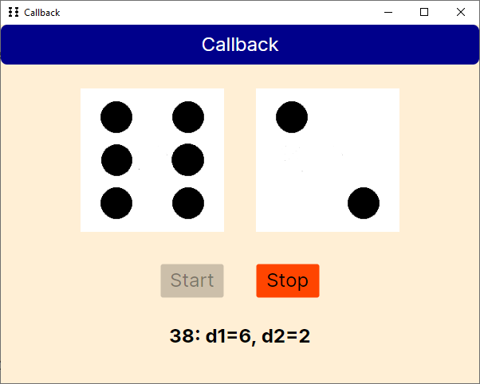
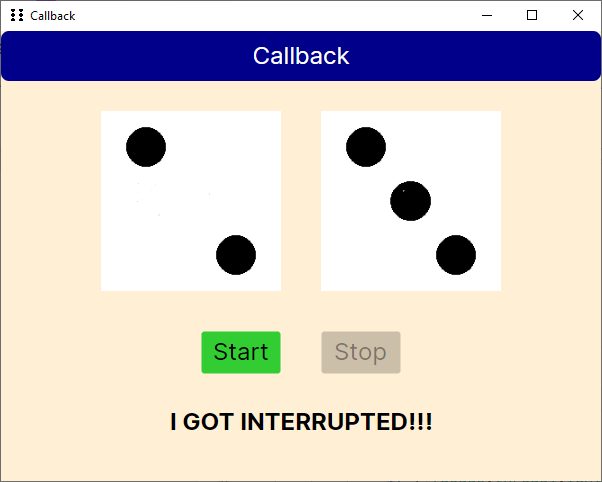
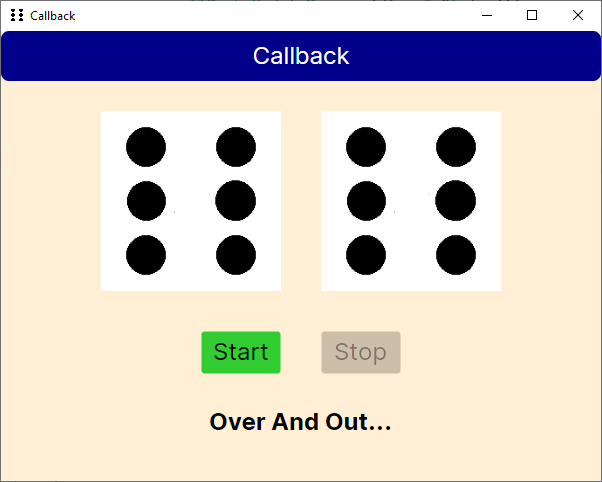

# Callback

We have provided the following classes in the `vop` folder:
- `CallBackInterface.cs`
- `Dice.cs`
- `FacadeWithCallback.cs`
- `MainWindow.axaml`
  - `MainWindow.axaml.cs`

This code is supposed to run continually and keep rolling dices, until it lands on two 6's. However, it currently doesn't work!
Study the code and implement the tasks below in the `MainWindow.axaml.cs` file.

### Task 1

Implement the `ButtonHandler()` method such that the events from the `ButtonStart`:
- Creates a new instance of `FacadeWithCallBack` and passes the `MainWindow` (`this`) as a parameter.
- Call the `Run()`-method of the just created `FacadeWithCallBack` instance.
- Disable the `ButtonStart`.
- Enable the `ButtonStop`.

### Task 2

Implement the `ButtonHandler()` method such that the events from the `ButtonStop`:
- Calls the `Stop()`-method on the `FacadeWithCallBack` instance.
- Disable the `ButtonStop`.
- Enable the `ButtonStart`.

### Task 3

Implement the `UpdateMessage()`:
- It should use `Dispatcher.UIThread.Post` as follows:

```csharp
Dispatcher.UIThread.Post(() =>
{
    // Code
});
```

- Implement such that it sets the `message` argument into the `LabelInfo`.

- The `ButtonStop` fires, i.e, `ButtonHandler(ButtonStop, new KeyEventArgs());`, if the `FacadeWithCallBack` thread is not alive.
  - You can check access the facade thread by calling on the facade as such: `_facade.FacadeThread`

### Task 4
`UpdateImages()` is already implemented, but it is commented. Uncomment it and run the code.

You should be able to see the following situations when running the code:





